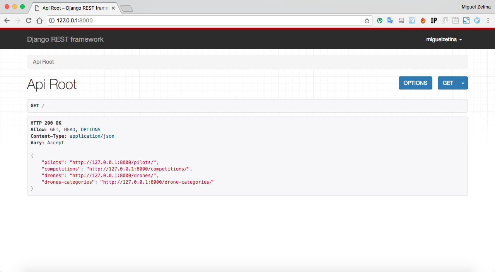
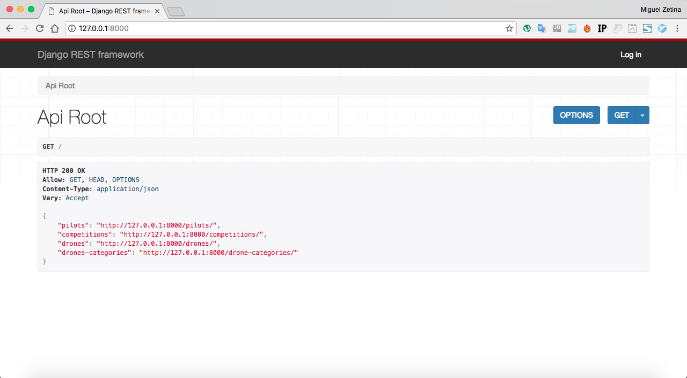
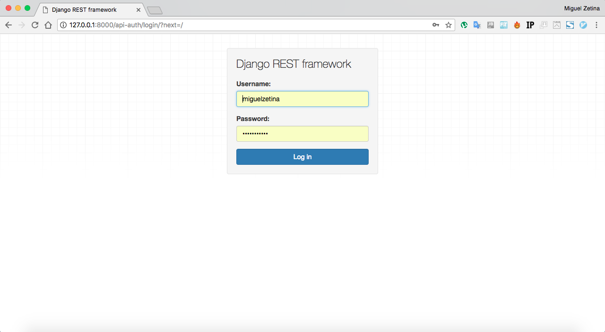
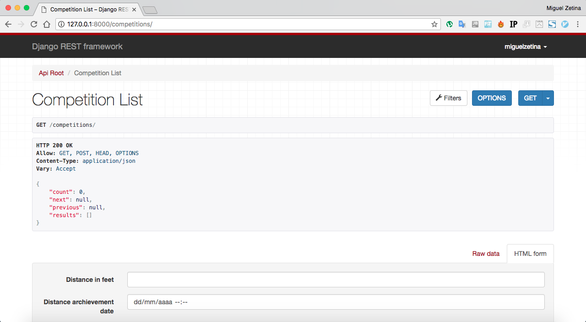
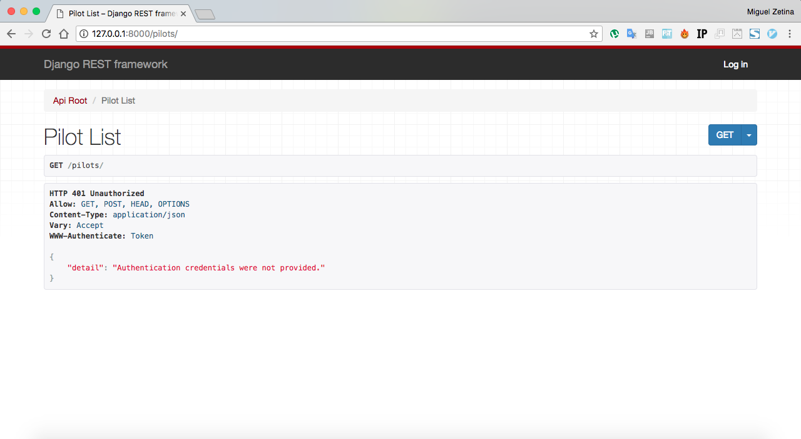

# RESTful-Drones-with-Django-Rest-Framework
RESTful web service to management of drones, pilots and competitions 

### Clone repository:
Fork the repository and:

```git clone --recursive git@github.com:{ yourusename }/RESTful-Drones-with-Django-Rest-Framework.git```

### Create a virtual environment:
If you don't have installed VirtualEnv:

```$ pip install virtualenv``` or ```$ sudo pip install virtualenv```


Create virtualenv:

```$ virtualenv -p python { nameYourVirtualenv }```

Run virtualenv:

```$ source {nameYourVirtualenv }/bin/activate```


### Install requirements:

```$ pip install -r requirements.txt```

If you have message error ```access denied```, run:

```$ sudo pip install -r requirements.txt```


### Create superuser:

```$ python manage.py createsuperuser```

And follow instructions


### Run server:

```$ python manage.py runserver```

Access to ```127.0.0.1:8000``` in your browser










